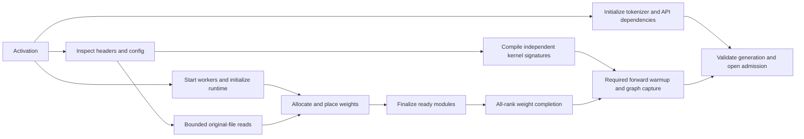

# Advancing model startup toward the hardware limits

**Execution update:** [coalesced direct reads and asynchronous batched uploads
are implemented and deployed](COALESCED-LOADER-IMPLEMENTATION.md). The latest run
reached health in 114.68 seconds and loaded target weights in 41.8–42.4 seconds.
The investigation below records the baseline and ranking before that work.

2026-09-13. Exploration against the deployed `spark-vllm:0.29.0-nvme2`
implementation, original checkpoint headers, and the last four-Spark activation.
The proposals below have not been deployed. The measured baseline remains
**131.27 seconds from controller launch to API health**, with hosts already
booted and compiler/driver caches present. Target streaming alone took 59–61
seconds. Empty-cache and host-reboot startup remain untested.

The largest opportunity is to read each source byte once across the cluster,
place only the bytes each rank needs, and overlap this with independent startup
work. Merely increasing the current reader's thread count cannot achieve that.

The governing rule is: **each substantial interval on the critical path should
either approach a useful hardware limit or have an explicit dependency that we
can remove, overlap, or amortize.** Track useful bytes alongside physical bytes.
Four ranks reading four copies can saturate four disks and still waste most of
their bandwidth. One Python thread at 100% leaves a parallelization opportunity;
it does not saturate the CPU package. Spinning all cores does not count as work.

GPU compute, communication bandwidth, and launch/barrier latency belong in this
accounting too. Spark CPU and GPU allocations share physical memory; overlapping
their copies can compete for the same DRAM bandwidth. A short unavoidable
dependency can finish faster than an elaborate attempt to saturate hardware.

## What the existing evidence establishes

| Rank 0 accounting, final activation | Seconds | Interpretation |
|---|---:|---|
| Target checkpoint stream | 59.10 | Includes reader waits, uploads, and native-consumer backpressure |
| Draft checkpoint stream | 1.34 | Nested within model loading |
| Remaining model-loading work | 14.12 | Arithmetic residual: construction, processing, gates, and other overhead |
| Engine KV initialization and warmup | 19.06 | Separate reported engine interval |
| Outside reported model/engine intervals | 37.66 | Controller, runtime startup, API setup, polling, and unassigned overhead |
| Launch to detected healthy API | **131.27** | Generation check follows this timestamp |

This is approximate accounting using rank 0, not a synchronized critical-path
trace. Other ranks, overlapping work, and log rounding prevent interpreting
each subtraction as an independently removable duration. Nevertheless, deleting
the entire 59.10-second target stream from this budget still leaves about
**72 seconds**. Storage changes alone cannot deliver a 60-second total under
otherwise unchanged startup behavior.

The original target has 282 files, 177,569 tensors, 405.220 GB of payload, and
only 21.856 MB of headers. Each rank recorded about 405.206 GB of process storage
reads. Across four ranks that is about 1.62 TB read to construct a roughly
405 GB distributed target. Prepared rank artifacts previously held about
101.4 GB per rank, supporting the scale of this amplification; replication and
layout changes mean the ratio is not exactly four for every parameter.

The observed read-counter/wall-time ratio is 6.68–6.86 GB/s. This exceeds the
supplied 4–5 GB/s specification, so the specification cannot be treated as a
verified cap for these observations. The counter is not a device-utilization
measurement. We use 4–5 GB/s for conservative design arithmetic and keep the
observed results separate. No prerequisite storage benchmark campaign is needed.

Prepared-artifact reads previously achieved about 12.6 GB/s with aligned direct
I/O. That is evidence to test a coarser direct-I/O path for original shards,
not a proven ceiling transferable between these different workloads. The final
pump recorded 20.83 seconds waiting for tensors, 18.30 seconds staging them, and
13.89 seconds of consumer backpressure. These are producer-side intervals inside
the 59.10-second stream; reader workers, GPU execution, and the consumer overlap.
They cannot prove either disk saturation or its absence. The SDK describes one
logical chunk per tensor, so coalescing deserves priority, but this alone does
not establish one physical NVMe command per tensor or a proven IOPS bottleneck.

Existing logs narrow down several other targets:

- API initialization first logs at 16:51:05; engine initialization at 16:51:16;
  the worker registers the loader at 16:51:20; model loading begins at 16:51:24.
  The dependency chain before loading is real. These timestamps do not prove
  that all of it is Python import time.
- The first NCCL communicator reports 0.23 seconds of initialization; several
  subsequent communicators report 0.01–0.02 seconds. The verbose NCCL log volume
  is not evidence of a large initialization bottleneck.
- Model loading ends at 16:52:38. KV setup is reported at 16:52:43. A cached
  general FlashInfer autotune pass still executes for about 2.8 seconds;
  graph capture takes about 4 seconds. Engine initialization finishes at
  16:52:57 and the API server starts at 16:53:00.
- The first generation logs additional Triton JIT work at 16:53:03–04, including
  DCP candidate packing and DFlash sampling/input kernels. API health therefore
  does not establish absence of a first-request compilation penalty.
- Health detection sleeps five seconds between checks, plus request/inspection
  overhead. Better timestamps improve attribution; changing polling alone does
  not make the model ready earlier.

Evidence: [activation results](../results/nvme-loader/stream-results.json),
rank 0 log (local reference: `results/nvme-loader/nvme-stream-1789318252-spark-06c4.local.log`),
[checkpoint layout](../results/nvme-loader/checkpoint-layout.json), and
[implementation report](DYNAMIC-INGESTION-IMPLEMENTATION.md).

The [offline probe](../runtime/nvme_loader/probe_boot_roofline.py) reproduces
the arithmetic and checks synthetic int32 tensors with the three recorded
packed-weight shapes across all four ranks. All 12 transpose/slice equality
checks passed; intermediate storage dropped from 6 MiB to 1.5 MiB. It also
enumerated touched 4 KiB pages with aligned and unaligned tensor offsets,
confirming the down-projection read amplification described below. This validates
the layout hypothesis, not native quantizer behavior or GPU speed. Results:
[boot-roofline-probe.json](../results/nvme-loader/boot-roofline-probe.json).

An additional 18 CPU checks compared the saved installed Marlin scale-permutation
helper with a batched equivalent: 1, 7, and 256 experts; grouped, channelwise,
and int8-activation branches; contiguous and strided inputs. All matched exactly.
These checks cover the permutation operation, not complete quantized inference.

## Ranked by likelihood of delivering a useful improvement

Ranks reflect implementation confidence and compatibility, rather than maximum
theoretical savings. None of the potential savings below is a measured new boot.

| Rank | Advancement | Main opportunity | Applicability and difficulty |
|---|---|---|---|
| 1 | Coalesce source reads, batch transfers, and simplify placement | Request granularity, per-tensor synchronization, Python loops, extra transpose traffic | Generic transport; guarded layer/quantizer optimizations; medium |
| 2 | Overlap startup and prepare the actual serving kernels | Pre-load dependency chain and warmup tail | Broadly useful, with explicit model/runtime dependencies; medium |
| 3 | Cooperatively read original files with an existing distributed loader | Four full disk reads become one distributed read | Broad safetensors transport, but network and memory constraints; medium |
| 4 | Dynamically plan rank-selective reads | Avoid physically reading unneeded contiguous regions | Generic planner with declared layer/quantizer placement rules; medium–high |
| 5 | Read once and scatter final rank slices | Remove redundant disk, network, and staging bytes together | Highest loading upside; explicit placement contract; high |
| 6 | Keep runtime workers alive across architecture changes | Repeated imports, CUDA setup, construction, and process startup | Long-term switching architecture; high |

### 1. Batch transport and eliminate repeated placement work

The deployed pipeline has 32 reader requests and a shared 2 GiB CPU buffer,
but exposes one owning tensor of lookahead to the native consumer. Each of
177,569 tensors gets a blocking upload before publication. Many are tiny shape
or scale tensors. A separate upload stream already reduced target streaming
from roughly 66 to 59 seconds; the next step is fewer host synchronizations and
fewer dispatches, rather than more unbounded buffering.

That comparison contains one full activation per variant. It supports the next
experiment but does not isolate causality or establish run-to-run variance.

Use a byte-budgeted ring of larger transfer batches. Pack small neighboring
tensors into a batch, submit uploads, publish a completion event, and let the
consumer stream wait on that event. Batch size and lookahead should respond to
queue starvation and memory pressure. Start with a small fixed number of slots;
increase it only when useful work is starved. Preserve source grouping and the
native loader's ordering/retention requirements.

This requires reader-buffer leases or an owning staging copy: setting
`non_blocking=True` on today's reusable Run:ai buffer is unsafe because the
reader can overwrite it before CUDA finishes. Batch allocation retention matters
too: a tiny alias can keep an entire batch alive. Account for physical backing
storage, allocator reservations, and native temporaries. DFlash currently keeps
its entire 4.919 GB source dictionary, so it needs a compatible owning path.

For storage ingestion, reuse the aligned direct-I/O approach already proven by
our prepared-artifact transport, extended to original-file ranges. Read into
reusable pinned slots and coalesce transfers across tensor boundaries where
ownership permits. This removes page-cache traffic and amortizes calls without
requiring an artifact format. Upstream fastsafetensors now has a Spark-oriented
unified-memory copier with a threaded `O_DIRECT` path. Its C++ implementation
still uses pinned bounce buffers and CUDA copies; a unified-memory label does
not imply zero physical copies. It is a useful implementation comparison, not
proof that switching libraries will improve our current measured result.
[Unified copier](https://github.com/foundation-model-stack/fastsafetensors/blob/main/fastsafetensors/copier/unified.py),
[underlying reader](https://github.com/foundation-model-stack/fastsafetensors/blob/main/fastsafetensors/cpp/ext.cpp).

The installed GLM native loader scans a list of 768 expert mapping entries for
each expert tensor. There are 175,104 expert-named tensors. Build an index once,
preserving ordered matches, redundant-expert mappings, and fallback behavior.
Do this before adding processes to parallelize Python string matching.
The existence of the scan is confirmed; its share of boot time is not measured.

The installed `marlin_moe_permute_scales` also loops in Python over every expert,
launching the same scale permutation separately. Batch that permutation across
the expert dimension, preserving each expert's permutation boundaries, dtype,
and final shape. This belongs to the shared quantizer implementation and can
benefit unrelated architectures using it. Its runtime contribution is unmeasured.
Marlin scale processing (local reference: `results/nvme-loader/inventory/model_executor/layers/quantization/utils/marlin_utils.py`).

For the installed compressed-tensors MoE path, `weight_loader` performs
`loaded_weight.t().contiguous()` before the later TP narrowing. Move selection
before materialization where the layer's layout contract permits it, or fuse
the strided source read directly into the destination copy/repack. At TP4 the
materialized intermediate can shrink to one quarter. This alone does not reduce
disk reads, and the entire boot does not become four times faster.

There is another explicit synchronization path to inspect. After each quantized
module is finalized, the installed loader checks UMA memory pressure. With at
least 512 MiB of reclaimable allocator cache and at most 20% system memory
available, it synchronizes the device and releases cached allocations. That
condition is plausible on these nearly full nodes; its firing count and total
time are currently unknown. Smaller reusable repack workspaces and better
transient scheduling may reduce repeated releases. Keep the pressure safeguard
until a replacement demonstrably prevents OS thrashing and allocation failure.
Installed memory-pressure guard (local reference: `results/nvme-loader/inventory/vllm/utils/mem_utils.py`).

Validate exact post-load parameters and generation against native loading for
both dense and quantized MoE fixtures, including padding, scales, empty tensors,
aliases, and failure cleanup. Keep native handling for unsupported layouts.

Source: MoE placement (local reference: `results/nvme-loader/inventory/model_executor/layers/fused_moe/routed_experts.py`)
and GLM dispatch (local reference: `results/nvme-loader/inventory/models/deepseek_v32/nvidia/model.py`).

### 2. Make initialization a dependency graph

Start lightweight checkpoint/header discovery, tokenizer setup, and explicitly
independent compilation tasks while engine/worker processes initialize.
Headers are small enough to inspect dynamically. Parse independent files in a
bounded worker pool if this work is material; hand over compact descriptors
instead of serializing hundreds of thousands of Python tensor objects.

Begin bounded payload prefetch as soon as filenames and available RAM are known.
However, 2 GiB stores only about half a second at 4–5 GB/s. It cannot hide a
20-second startup gap: the buffer fills and the disk must stop. To sustain
early reads, either bring the consumer online earlier or provide justified
additional final/staging capacity. On these nearly full unified-memory nodes,
enlarging a startup buffer by tens of GB is not a general solution.

Build explicit dependencies for each module: source tensors and scales ready,
placement finished, quantizer postprocessing finished, then module ready.
Where postprocessing is local, run it while later modules read. Shared parameters,
cross-layer fusion, DFlash fused-KV construction, and all-rank gates retain their
required barriers. More GPU overlap is useful only if shared DRAM pressure does
not slow the loader by more than the overlap saves.

Compile known kernel signatures while weights stream, where compilation is
independent of parameter contents. Run content-dependent calibration, packing,
and real forward validation only after their inputs exist. Cache keys include
architecture/configuration, quantization, TP/DCP, device, kernel code, and toolchain.

The final log still reports first-request JIT kernels. Cover their actual DCP,
DFlash, sampling, and supported request-shape signatures during the overlapped
preparation phase. Review the repeated cached autotune pass for duplicate work;
retain necessary execution/initialization even when configuration search is a
cache hit. Keep graph capture's stream and allocation requirements intact.

Use three timestamps: API healthy, first correct token, and full configured
throughput ready. A staged eager-serving option is possible once all weights
and essential kernels are ready, but its temporary throughput must be reported.
Background graph capture while requests run is not a free or assumed-safe
operation. This proposal does not rely on serving incomplete weights or reusing
KV from an unrelated model.

The production loader currently implements neither early cross-process prefetch
nor per-module finalization. The graph is the intended dependency structure.

### 3. Cooperate across disks using existing distributed transport

This is the fastest route to testing the read-once idea without first describing
every model's TP layout. Give different source regions/files to different ranks,
and distribute full tensors so native placement still sees its usual inputs.

Run:ai already documents global distributed reads with broadcast. Its default
local grouping gives no sharing benefit on one-GPU-per-node Sparks; a global
group is needed. Its reusable device buffers require ownership handling and
about twice the largest tensor in staging. This is a separate integration path,
not an environment-only switch for our current CPU reader.
[Run:ai distributed streaming](https://github.com/dsx-ai-factory/runai-model-streamer/blob/master/docs/src/usage.md).

**Topology is a compatibility gate.** The cluster's documented non-adjacent
point-to-point/all-to-all paths fail on the switchless ring. A library must use
supported ring collectives or explicit adjacent-neighbor forwarding; arbitrary
world-group communication is insufficient. Inspect the installed implementation
and collective ordering before any full-cluster experiment. All ranks must
agree on memory admission and fallback before entering communication, including
the replicated draft whose TP policy differs from the target.
[Recorded ring restriction](DESIGN.md).

InstantTensor documents distributed loading, direct I/O, and pipelining;
fastsafetensors exposes distributed tensor slicing and now documents unified-memory
Spark support upstream. Evaluate their installed versions before upgrading or
building a custom engine. Upstream capabilities do not establish that our
installed versions implement the same features or fit this deployment.
[vLLM InstantTensor integration](https://docs.vllm.ai/en/latest/models/extensions/instanttensor/),
[fastsafetensors overview](https://github.com/foundation-model-stack/fastsafetensors/blob/main/docs/overview.md),
[platform support](https://github.com/foundation-model-stack/fastsafetensors/blob/main/README.md).

For an ideally balanced TP4 full-tensor distribution, each node reads about
101.3 GB and receives about 303.9 GB from peers. Its native loader still handles
405.2 GB. This trades disk duplication for network traffic and still wastes
placement work. Real ring routes add forwarding and synchronization costs.
The current NCCL logs report GPUDirect RDMA disabled, so include host staging
and shared-DRAM traffic; do not assume an NVLink-like fabric.

A simple host-receive-plus-device-copy accounting assigns approximately three
DRAM byte movements per received payload byte: NIC write, copy read, copy write.
That is about 0.91 TB for 304 GB received, before sends, forwarding, placement,
and other traffic. This is an illustrative traffic model; actual transport,
cache behavior, and copies must be checked, not inferred from `GDR 0` alone.

Run the experiment only with explicit memory caps, consistent collective order,
timeouts, source-identity agreement, and all-rank abort. Preserve the current
owning-tensor contract. InstantTensor's optional borrowed-buffer mode cannot
replace owning tensors in loaders that retain them.
[InstantTensor ownership rules](https://github.com/scitix/InstantTensor#zero-copy-mode).

### 4. Read only physically useful local ranges

Headers plus declared placement rules can generate a read plan on demand from
ordinary checkpoints. No preparatory rewrite or payload scan is necessary.
The transport stays architecture independent; parameter/layer/quantizer code
declares partition dimensions, packing, replication, fusion, and destination
layout. Unknown semantics use the tested full-tensor path. Shape alone cannot
identify these semantics reliably.

Sort source ranges by file offset, coalesce adjacent reads, and keep enough
aligned requests outstanding across all files. Selective reads must optimize
physical blocks and request count, not just logical bytes.

For example, a recorded down-projection packed tensor is `[6144, 256]` int32.
The TP4 slice selects 64 columns: 256 bytes from each 1024-byte row. Those
pieces touch every 4 KiB block of the 6 MiB tensor. Tiny individual reads do
not turn this into 1.5 MiB of NVMe traffic. Reading the larger contiguous region
and gathering in memory is likely preferable. Gate/up row slices are contiguous
and can avoid three quarters of their source region.

An illustrative equal-projection calculation gives expert physical reads of
`383.38 GB × (2/3 × 1/4 + 1/3) ≈ 191.69 GB` per rank. Leaving non-expert bytes
and the draft fully read gives about 218.45 GB per rank. Actual dtype, packing,
alignment, scales, and layer differences need the real descriptor plan; this
is an estimate, not a guarantee or a completed generic TP loader.

### 5. Read once, then scatter final rank slices

The strongest architecture combines the previous ideas. Distribute reading of
the original checkpoint across local NVMes. Each owner reads contiguous ranges,
splits/transforms them according to validated descriptors, retains its own
slice, and sends each other rank only its required slice. Batch small transfers;
pipeline reads, transformation, and sends in a bounded ring with backpressure.

In the ideal uniformly partitioned case, each rank reads about 101.3 GB, retains
25.3 GB from its own reads, and sends/receives about 76.0 GB of useful slices.
These are endpoint payload volumes; physical ring forwarding, replicated
parameters, padding, and protocol overhead increase traffic. Schedule using
the physical links and the slowest rank, not aggregate NIC marketing bandwidth.

Implement remote delivery through adjacent peers; direct owner-to-opposite-rank
sends are invalid here. With balanced TP4 payloads, shortest-path routing, and
opposite-node traffic split equally between both directions, the average hop
count is 4/3. Each node transmits about 101.3 GB including forwarded slices;
each of eight directed neighbor links carries about 50.7 GB. A one-direction
ring instead averages two hops and carries about 152.0 GB per directed link.
Both exclude replication and protocol overhead. Full-tensor broadcast has
different forwarding volumes and must be budgeted separately.

At the supplied 4–5 GB/s, ideal local disk time is about **20–25 seconds**.
Full local reading of 405.2 GB would require **81–101 seconds** at that assumed
rate. For the cooperative pipeline, a resource lower bound is:

`max(local source bytes / NVMe rate, bytes over busiest link / link rate,
     total DRAM traffic / memory rate, transform work / compute rate)`

Add startup dependencies, pipeline fill/drain, readiness barriers, and warmup.
Do not add or subtract overlapping pipeline times as if they were serial.
Achieving a 30–60 second total requires both this smaller transfer budget and
the initialization changes above. The 20–25 seconds is a disk-only bound.

An optional derived rank cache can be written as completed slices emerge.
That makes subsequent activations cheaper without requiring advance preparation,
but simultaneous NVMe writes may hurt the first activation. Write opportunistically
after admission or with a strict priority/bandwidth budget; publish atomically
with a valid identity. It is not necessary for first-use loading.

### 6. Keep the runtime skeleton alive

Keep an API/admission layer, metadata service, and carefully scoped CPU helpers
resident first. Later investigate long-lived workers owning CUDA contexts and
communication groups while replacing model generations. This could remove
repeat startup dependencies that weight streaming cannot touch.

Generic architecture replacement needs complete teardown of old model objects,
graphs, allocations, workspaces, callbacks, scheduler state, and incompatible
KV. A model-specific graph cannot simply be restored for a different model.
The current loader explicitly rejects in-place reload; changing that is a
separate runtime project. Limited free RAM also prevents assuming both large
models can coexist for an instantaneous switch.

Our earlier import-only preload experiment already created a native CUDA thread
despite `torch.cuda.is_initialized()` being false. Its fork emitted a
multithreading warning. Use independently spawned processes or explicitly
managed persistent workers; that probe did not establish safe CUDA forking.
MicroVM or GPU snapshots do not address the observed duplicate tensor traffic,
so they are lower priority for this next iteration.

## Execution and acceptance

First implement bounded transfer batching and indexed placement; validate them
on the sandbox with cancellation, alias-retention, and deterministic placement
fixtures. Test transpose/slice equivalence across actual quantized shapes before
patching native callbacks. Separately build the descriptor planner with no GPU
or payload I/O required. Its report must expose logical bytes, aligned physical
bytes, request counts, and fallback coverage for arbitrary checkpoints.

Next use isolated Spark fixtures for GPU ownership and distributed transport.
Compare native versus candidate post-load parameter hashes and deterministic
generation, then activate the full four-rank target with automatic rollback.
Do not infer compatibility of unrelated quantizers from the GLM result.

Instrument that functional activation with monotonic stage boundaries, per-core
CPU use, disk bytes and queue behavior, queue occupancy, and available GPU/DRAM
and network counters. Record blocked-on-reader, consumer, memory-budget, and
collective intervals. Hardware counters may need platform-specific support;
unsupported counters remain unknown. `/proc/io`, `%util`, RSS, or GPU busy alone
do not establish a bandwidth roofline. No standalone fio campaign is a dependency.

For a substantial interval with no resource near its useful limit, identify the
dependency and propose the next removal/overlap. For a saturated interval, first
ask whether its work or byte volume can be reduced. Apply both tests: saturation
alone is not the endpoint.

Accept a change only when launch/stop-to-health and first-correct-token improve,
correctness and durable-KV isolation pass, memory remains bounded, and full-load
serving throughput does not regress. Report process restart, persistent-cache
restart, and true host/empty-cache cold startup separately. Retain the current
131.27-second result until a new activation actually demonstrates better timing.

## Fable review disposition

[Fable's review](../results/nvme-loader/fable-boot-roofline-review.md) strengthened
the plan's topology gate, added Marlin scale-loop vectorization, and put read
coalescing explicitly first within the immediate transport work. The installed
memory-pressure guard and synthetic permutation checks were verified locally.

Several review claims remain hypotheses: producer timings do not prove an IOPS
bottleneck; the prepared reader's 12.6 GB/s does not establish original-checkpoint
throughput; and no new 32–35-second target-stream result has been demonstrated.
The review's bidirectional link estimate of about 50 GB is consistent with
balanced forwarding, but that is 4/3 endpoint traffic in aggregate, not twice.
These distinctions prevent the optimization plan becoming an unsupported timing
promise. Production has not changed during this investigation.

The supplemental review proposed rate-limiting allocator releases and described
their firing as confirmed. We have verified the guard's code and plausible
pressure, but not its actual invocation outcomes or transient reuse. Delaying
release is not automatically safe on shared-memory nodes. Record releases and
workspace behavior before changing that safeguard. The 218 GB selective-read
estimate also remains illustrative: three packed-weight examples do not validate
the placement semantics of all checkpoint tensors.
