# Coalesced original-checkpoint loading: implementation and Spark results

2026-09-13. The coalesced reader is implemented, tested, and deployed on all four
Sparks as `spark-vllm:0.29.0-nvme4`, generation `nvme-stream-1789323352`.
The Spark controller now defaults to coalesced CUDA loading with 128 MiB batches.

**Final result: 114.68 seconds to a healthy API, 115.20 seconds to first streamed
output, and 41.8–42.4 seconds for target weights.** The count-to-100 response and
same-model durable-KV recovery passed. Original checkpoint files are consumed
directly; no prepared rank files or advance payload-hashing pass is required.

These are fresh worker/container activations on already booted hosts with
compiler/driver caches present. Workers were stopped before each timed launch.
The times exclude the preceding shutdown and fixture-testing downtime. A host
reboot or empty compiler-cache boot has not been measured. This does not achieve
the original 30–60 second end-to-end objective.

## Measured progression

| Configuration | Target stream, all ranks | Launch to healthy | Launch to first output |
|---|---:|---:|---:|
| Previous Run:ai stream | 59.1–60.7 s | 131.27 s | Not recorded |
| Coalesced 64 MiB, host waits for each batch upload | 53.4–54.9 s | 120.49 s | 121.01 s |
| Coalesced 64 MiB, asynchronous upload handoff | 44.9–45.7 s | 114.72 s | 115.21 s |
| **Coalesced 128 MiB, asynchronous upload handoff** | **41.8–42.4 s** | **114.68 s** | **115.20 s** |

The final target interval is roughly 29–31% shorter than the corresponding
Run:ai intervals. Total readiness improved by 16.59 seconds, about 12.6%.
There is one full activation per configuration, not enough to characterize
variance or attribute every end-to-end difference to the reader. In particular,
128 MiB improved weight loading while total readiness remained essentially the
same as 64 MiB because the rest of startup varied.

First output means receipt of the first nonempty SSE content chunk; the full
response was subsequently validated as the correct sequence 1 through 100.
For the final run that request began immediately after health detection, took
0.523 seconds to first content, and finished validation 118.81 seconds after
launch. This is a specific functional request, not a general TTFT SLA.

## How it works

The existing default-loader extension preserves vLLM checkpoint selection,
secondary-source prefixes, model construction, and native placement. Safetensors
headers supply tensor names, shapes, dtypes, and absolute byte offsets. The
official parser validates the files. The coalesced planner groups physically
adjacent complete tensors into batches, without interpreting architecture or
quantization layouts.

A persistent pool of 32 threads reads aligned ranges with `preadv` and
`O_DIRECT` into two pinned host tiles. With the final profile, the usable tiles
are 128 MiB each, plus a small alignment allocation. Normal batches produce one
large GPU upload. A tensor larger than a tile is assembled through multiple
tiles into one owning output allocation; host staging never grows to its size.

The tiles alternate across batch boundaries. Each tile has a CUDA completion
event, which the producer waits for before overwriting its memory. The producer
can therefore read the next batch while the previous upload runs. Completed
read batches cross the producer queue with an upload event; the native consumer
stream waits on that event before touching their tensor views. Storage is also
recorded on the consumer stream so asynchronous native work cannot observe an
allocation recycled too early.

```mermaid
flowchart LR
    A[Original safetensors headers] --> B[Contiguous byte-batch plan]
    B --> C[32 concurrent aligned reads]
    C --> D[Two reusable pinned tiles]
    D --> E[CUDA upload stream]
    E --> F[Completion event]
    F --> G[Owning typed views on consumer stream]
    G --> H[Native placement and repacking]
    H --> I[Engine warmup and serving]
```



The native consumer remains on its original thread. Views retain their backing
batch, and the owned-byte budget charges that entire storage allocation rather
than the visible slice. The default owned budget is 6 GiB. DFlash legitimately
retains its complete approximately 4.92 GB source before placement. Unknown
retention patterns can exceed the budget and fail activation; there is no
unbounded accumulation or unsafe buffer reuse.

The direct-I/O probe runs before native consumption, once per source filesystem.
Unsupported filesystems or unaligned tensor encodings select native loading.
Rare legal short direct reads finish through a buffered descriptor reopened on
the same inode; actual EOF before required bytes fails. Source stamps are
checked before batches and after completion. Header identity remains a metadata
consistency check, not a cryptographic hash of every payload byte.

## What the counters show

| Final rank 0 target | Result |
|---|---:|
| Source payload / tensors | 405.220 GB / 177,569 |
| Read syscalls | 104,014 |
| GPU upload operations | 3,252 |
| Host staging allocation | About 256 MiB |
| Peak live owning output storage | About 3.82 GB |
| Target interval | 42.281 s |
| Producer read wait | 39.610 s |
| Producer backpressure | 1.084 s |
| Host-tile reuse wait | 0.059 s |
| Target + draft construction/loading/processing | 56.880 s |
| Engine KV initialization and warmup | 15.73 s |

The synchronous coalesced version spent 7.91 seconds waiting for batch uploads.
The asynchronous version moves that dependency onto the consuming CUDA stream;
its `upload_wait_seconds` now measures only final reader teardown. It must not
be interpreted as zero GPU copy work. The slot-reuse wait above is recorded
separately.

Host samples during intervals with more than 1 GB/s of NVMe reads recorded
approximately 9.4–9.6 GB/s average read traffic across the final ranks, and about
0.88 busy CPU cores per node. Those intervals include target/draft loading and
are not an exact synchronized target-only trace. The final activation's lowest
sampled available memory was approximately 1.68 GB on rank 0; the memory guard
reported no pressure failure. Logical budgets do not include allocator caches,
native temporaries, or every other process's allocations.

These host counters establish useful progress and remaining headroom, not a
verified hardware roofline. GPU and DRAM bandwidth were not sampled. Linux disk
busy time and queue depth are retained in the evidence but are not substitutes
for bandwidth saturation on a multi-queue NVMe device. Observed read rates are
higher than the supplied 4–5 GB/s specification; that specification is not
treated as a verified cap. No separate storage benchmark campaign was run.

## Validation and recovery

- 37 sandbox tests passed: existing artifact/Run:ai coverage, coalesced real-file
  direct and buffered reads, EOF/short reads, oversized tensors, mixed dtypes,
  empty tensors, aliases, budget failure, source mutation, cancellation, early
  direct-I/O fallback, and streamed readiness-response validation.
- A standalone Spark CUDA test passed 132 tensor cases on a non-default stream.
  Artificially delayed uploads produced six pending-event handoffs, exercising
  the consumer dependency rather than relying on copies completing quickly.
- Unrelated Llama and GPT-2 GPU fixtures matched native loading exactly in
  post-load parameter hashes, generated token IDs, and token log probabilities.
- All three full four-Spark activations passed count-to-100 generation and
  same-model durable-KV recovery. The final KV probe recovered 1,664 external
  cached tokens with zero GPU prefix-cache hits.
- Three additional warm count-to-100 requests passed on the final deployment:
  first content arrived in 0.375–0.406 seconds and completion in 3.955–3.975
  seconds ([request results](../results/nvme-loader/coalesced-steady-count100.json)).
- A repeat fixture run initially raced the memory monitor before its first
  sample. Automatic rollback restored the prior service; the harness now waits
  for initial observations. This occurred before candidate weight loading.
- Fable reviewed the initial reader, short-read fixes, and asynchronous handoff.
  Review findings and dispositions are saved with the results.
- All four final container packages and the wheel match the workspace source
  hashes. The image retains the existing vLLM, Torch, CUDA, and model runtime.

The count-to-100 response exercises serving and records its duration; it is not
a broad steady-state throughput benchmark. Broader concurrency/long-context
performance has not been re-characterized in this change.

## Run and reproduce

```bash
PYTHONPATH=runtime/nvme_loader .venv/bin/python -m pytest \
  tests/test_nvme_loader.py tests/test_nvme_streaming.py \
  tests/test_nvme_coalesced.py tests/test_nvme_boot_observer.py -q
.venv/bin/python runtime/nvme_loader/build.py
.venv/bin/python runtime/nvme_loader/check_stream_models.py --cuda-only --backend coalesced
.venv/bin/python runtime/nvme_loader/sparkctl.py stream --observe-boot
```

The fixture command stops serving and uses saved native fixture baselines;
omit `--cuda-only` to regenerate the native baselines and also test CPU streaming.
Successful fixture runs leave workers stopped for the following activation;
failed fixture/activation runs restore the recorded last-good containers.

For another compatible vLLM deployment:

```bash
NVME_LOADER_MODE=stream NVME_STREAM_BACKEND=coalesced \
NVME_STREAM_DEVICE=cuda NVME_STREAM_BATCH_BYTES=134217728 \
  vllm serve /models/example --load-format nvme
```

The library's backend default remains Run:ai for compatibility; the Spark
controller explicitly selects coalesced/128 MiB. Select the prior transport
with `sparkctl.py stream --stream-backend runai`. Prepared-artifact mode remains
a separate path, and streaming does not automatically create those artifacts.

## Remaining work

Native placement, quantizer finalization, and engine warmup still run. The final
budget leaves roughly 72 seconds outside target streaming, so deleting target
I/O entirely would still not establish a sub-minute total. All four nodes also
still read the whole 405 GB target. The next substantial advances are startup
overlap and fewer physical source bytes through declared TP placement or
ring-compatible cooperative transport. Indexed expert dispatch and vectorized
Marlin scale preparation remain planned, not deployed. See the
[ranked advancement plan](BOOT-ROOFLINE-ADVANCEMENTS.md).

Evidence: [final activation and resource analysis](../results/nvme-loader/nvme-stream-1789323352-analysis.json),
[64 MiB async analysis](../results/nvme-loader/nvme-stream-1789323058-analysis.json),
[synchronous coalesced analysis](../results/nvme-loader/nvme-stream-1789322497-analysis.json),
[CUDA/model fixture checks](../results/nvme-loader/coalesced-async-model-checks.log),
[durable-KV verification](../results/nvme-loader/kv-coalesced-128-verify.json),
[deployment hashes](../results/nvme-loader/coalesced-deployed.json),
[build manifest](../results/nvme-loader/coalesced-build-manifest.json),
[Fable review](../results/nvme-loader/fable-coalesced-review.md).
