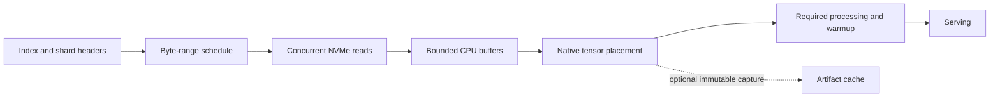

# Dynamic checkpoint ingestion from original model shards

**Implemented and tested:** the subsequent
[implementation report](DYNAMIC-INGESTION-IMPLEMENTATION.md) records original-shard
streaming at 59–61 seconds for target weights and a 131-second serving activation,
with GPU parity and durable-KV recovery. The text below is the preceding investigation.

Investigation: 2026-09-13. Recommendation: make concurrent ingestion of the
original checkpoint the first-load path, and treat prepared rank artifacts as
an optional cache. A separate full model preparation run is not fundamental.
Matching the prepared path's speed also requires reducing redundant reads,
tensor dispatch, and layout conversion; parallel file opening alone is insufficient.

This investigation inspected the installed Spark runtime, read checkpoint
headers, and exercised its installed streaming library on small CPU fixtures.
It did not restart serving or measure large-model streaming performance.

## What the actual checkpoint tells us

The [header inventory](../results/nvme-loader/checkpoint-layout.json) was produced
by [inspect_checkpoint.py](../runtime/nvme_loader/inspect_checkpoint.py), using
the index and headers without reading tensor payloads:

| Property | Target | Draft |
|---|---:|---:|
| Original safetensors files | 282 | 1 |
| Tensor entries | 177,569 | 96 |
| Source file bytes | 405.24 GB | 4.92 GB |
| Headers read | 21.86 MB | 10.6 KB |
| Largest tensor | 1.90 GB | 453 MB |
| Prepared bytes per rank, previous runs | 101.39 GB | 3.08 GB |

GB and MB here are decimal. The target's expert-named tensors account for
383.38 GB, about 94.6% of tensor bytes. There are both small shape/scale tensors
and large packed weights, so counting files or tensors is a poor scheduling unit.

Safetensors headers provide dtype, shape, and offsets into the tensor payload.
We can discover ranges before loading weights, including for a single-file
model. Original shard boundaries need not be loader scheduling boundaries.
The model index selects the canonical files; each shard header locates its
tensors. [Safetensors format](https://huggingface.co/docs/safetensors/index)

## What the installed loader actually does

The runtime has vLLM 0.29.0, Run:ai Model Streamer 0.16.1,
fastsafetensors 0.4.0, instanttensor 0.1.9, and safetensors 0.8.0. These were
checked inside the live container; newer online vLLM code is not the basis for
the implementation findings below.

The default iterator visits shards and yields tensors through `safe_open`.
The model consumes each tensor and performs name mapping, TP slicing, copies,
and other loader work before requesting the next one. Memory mapping can defer
physical reads until the consumer touches pages. It can also avoid touching
some non-local slices; a full-tensor streamer can increase physical bytes
relative to this behavior even while improving read concurrency.
For this GLM Marlin configuration, however, the full-tensor transpose described
below touches the expert tensors before slicing. Those tensors dominate the
checkpoint. Do not infer a large native mmap byte saving here; exact native
physical read bytes were not collected in this investigation.

The existing multithread option calls CPU `load_file` concurrently. This is
not a byte-budgeted disk pipeline: mmap creation does not prove payload pages
are resident, and completed futures can retain whole shard dictionaries.
The explicit prefetch option reads into page cache without a bounded moving
window. It divides files by global rank, which is not a complete local
prefetch schedule when every node has its own disk and needs all tensors.

The Run:ai iterator passes the file list to `stream_files`, then clones each
returned tensor before yielding it. This supports concurrent original-file
ingestion and preserves tensor ownership across buffer reuse. Our CPU fixture
check re-sharded Llama and GPT-2 into five files each, set concurrency to 32,
used buffers smaller than the total payload, and checked every retained tensor
after streamer shutdown: exact equality passed for all 49 tensors. This is a
transport correctness check, not GPU generation parity or a throughput result.
[Fixture evidence](../results/nvme-loader/streamer-fixtures.log)

A further mixed-format fixture exposed a compatibility gap: the installed
streamer omitted the zero-element tensor. The returned I32 packed weight,
BF16 scales, I64 shape, and F32 scalar were exact. A wrapper must synthesize
empty tensors from validated headers, in the expected order, or fall back;
silently dropping entries is not acceptable for generic model support.

The built-in Run:ai loader has a narrower source-selection path than
`DefaultModelLoader`: it does not reproduce the default primary/secondary
source iteration, prefixes, duplicate-index filtering, and weight tracking.
It also differs in expert filtering, allowed filename patterns, PyTorch-file
fallback, and TorchAO reconstruction strategy. Preserve expert filtering before
read scheduling where supported; filtering a completed stream only preserves
model semantics and does not save I/O.
A generic implementation should replace the default iterator while preserving
those surrounding semantics, rather than simply swapping loader classes.
Here, generic means multiple architectures using supported ordinary safetensors
serialization. TorchAO tensor subclasses, other specialized encodings, GGUF,
and PyTorch checkpoint files need their existing reconstruction path or a
separately validated reader; the file suffix alone is not a compatibility test.

Installed source references:

- Default source selection and loading (local reference: `results/nvme-loader/inventory/model_executor/model_loader/default_loader.py`)
- Iterators and prefetch (local reference: `results/nvme-loader/inventory/model_executor/model_loader/weight_utils.py`)
- Run:ai loader wrapper (local reference: `results/nvme-loader/inventory/model_executor/model_loader/runai_streamer_loader.py`)
- GLM/DeepSeek mapping and dispatch (local reference: `results/nvme-loader/inventory/models/deepseek_v32/nvidia/model.py`)
- Expert slicing and copies (local reference: `results/nvme-loader/inventory/model_executor/layers/fused_moe/routed_experts.py`)

## Ranked implementation paths

| Rank | Approach | Why / limitation |
|---|---|---|
| 1 | Bounded Run:ai ingestion inside the default loader | Most likely to deliver a useful generic first-load improvement soon. Already installed; original tensors still pass through native model loading. Whole tensors may be read redundantly on four nodes. |
| 2 | Custom concurrent range reader with native loading | Explicit byte budgets, aligned reads, coalescing, and read scheduling. Reuses our transport techniques but must reconstruct original tensors and preserve their lifetime. Full-tensor compatibility still has read amplification. |
| 3 | Dynamic TP placement plan with selective reads | Highest local-disk efficiency for supported layouts. Plan from headers plus actual parameter/quantization loader semantics; no prior weight conversion. Requires adapters and cannot infer arbitrary Python loader behavior from shape alone. |
| 4 | Distributed ownership: each source region read once, then scattered | Avoids every Spark reading the same bytes, including interleaved slices. Adds RoCE traffic and coordinated scheduling; native broadcast streamers are a useful intermediate, but broadcast is not selective scatter. |
| 5 | Capture prepared artifacts as a by-product | Makes later switches faster. Does not by itself accelerate the current load, and writes can compete with the reads we want to prioritize. |

Ranks indicate implementation confidence and order, not a prediction of measured
performance. Start with 1; combine 2 and 3 where redundant reads dominate;
consider 4 where the original storage layout makes local slicing ineffective.

Run:ai exposes concurrency and a CPU buffer limit. Its documented minimum
buffer is the largest tensor, and distributed streaming also needs GPU staging.
Our 1.90 GB embedding means a general whole-tensor path cannot promise the
prepared reader's roughly 128 MiB total staging footprint. Budget its buffers,
vLLM's clones, retained tensors, and device memory together. Test with a finite
budget that fits current Spark headroom, not the unlimited default.
[Run:ai memory and lifetime rules](https://github.com/run-ai/runai-model-streamer/blob/master/docs/src/usage.md)

## The pipeline to build

Read ahead across files and within large tensors. Start with the existing
32 outstanding 4 MiB transport design as a tunable default, not a claim that
this queue depth guarantees saturation. Coalesce adjacent small tensors;
reserve memory for the next tensor/group the consumer needs before filling
the queue with later work. This avoids a reorder buffer deadlock. Preserve
the model's expected consumption order until reordering is explicitly validated.

Keep model mutation in the native consumer. Arbitrarily running its
`weight_loader` callbacks on 32 threads risks races in fused parameters,
loader bookkeeping, and CUDA streams. Completed I/O can arrive out of order
without changing model mutation order. Buffer reuse must wait for both GPU
copy completion and any retained CPU references; the iterator advancing is
not proof that the model stopped using a tensor. Cloning is the conservative
compatibility path, with its memory/copy cost accounted for.

The GLM loader also linearly searches expert mappings for many of its 175,104
expert-named tensors. Compile those mappings into a lookup once where semantics
allow, retaining fallback for ambiguous names. Changing that lookup requires
an explicit model overlay; an iterator replacement alone cannot do it. This is
a plausible consumer bottleneck, not an attribution of the previous 358 seconds
to Python. Required quantization/kernel processing remains on the path unless
a dependency-aware per-module schedule is separately implemented and validated.

For a fixed memory budget, sustained ingestion is limited by the slower stage:

`useful throughput <= min(storage throughput / read amplification, placement throughput)`

If placement consumes 1 GB/s while NVMe produces 5 GB/s, even a 2 GB queue fills
in about half a second. More read threads cannot solve that sustained mismatch.
The objective is sustained useful weight placement at storage speed, with idle
disk periods explained by explicit backpressure, not by sequential shard waits.

## Why reading only our quarter is not always cheap

The installed MoE loader splits gate/up projections along the output dimension
and down projections along the input dimension, with extra rules for packing,
transposition, padding, and scales. Consider this actual packed down tensor:

`shape=[6144,256], dtype=I32, size=6 MiB`

In original checkpoint coordinates under TP4, one rank needs 64 columns: 256 bytes out of
each 1,024-byte row. Its useful slice is 1.5 MiB, but the selected bytes touch
essentially every 4 KiB block of the 6 MiB tensor. Thousands of tiny reads
do not turn this into 1.5 MiB of physical NVMe traffic. Buffered reads also
operate through pages; actual direct-I/O alignment must be checked per filesystem.

In contrast, gate/up row slices can be contiguous. A planner should calculate
the union of required aligned ranges and choose between a selective local read,
a coalesced full read, or an owner read followed by scatter. Do not assume
TP4 means a fourfold reduction in physical reads for every original layout.

There is an additional cost in the actual Marlin path: its compressed-tensors
MoE method sets `is_transposed`, and the native expert callback performs
`loaded_weight.t().contiguous()` before narrowing to the local TP slice.
Thus it materializes the full transposed source tensor even for the projections
whose on-disk rank slices could be contiguous. A verified placement adapter
could select the rank's source slice first and transpose just that slice.
Preserving scale, packing, padding, and fused-destination semantics is required;
this optimization cannot be achieved by only replacing the disk iterator.

An intermediate experiment is yielding complete device tensors so the native
transpose runs on the GPU. The installed fastsafetensors and InstantTensor
iterators yield device tensors; distributed Run:ai does too. This may improve
consumer throughput without changing slice semantics, but adds full-tensor
device staging and possibly network traffic. It needs independent parity and
memory validation; moving bytes to the GPU does not reduce disk read amplification.

The first streaming implementation should compare owning pinned CPU buffers
with complete device staging, rather than assume default CPU clones sustain
the required placement rate. Run:ai's Python wrapper accepts `device` separately
from `is_distributed`; non-distributed CUDA support still needs validation in
the installed lower-level implementation before using that combination.

Selective loading needs an explicit contract: source ranges, logical tensor
shape, destination slice, packing/scale rules, replication, and completion
dependencies. Passing an already-sliced tensor to an unmodified native callback
can slice it a second time. Use a verified placement adapter or retain the full
native path. Fake/meta execution cannot generically discover callbacks that
inspect tensor values or depend on data-dependent state.

Distributed Run:ai uses broadcasts and defaults to local-node distribution;
global distribution must be selected to share reads across these four
single-GPU nodes. It makes every rank receive tensors, rather than delivering
only its slice. Treat broadcast and selective scatter as separate candidates.
The installed fastsafetensors integration disables GDS for a multi-rank group;
changing its flag alone is not a direct-NVMe-to-GPU solution for this deployment.
[Run:ai distributed behavior](https://github.com/run-ai/runai-model-streamer/blob/master/docs/src/usage.md)

## Preparation, identity, and serving

No prepared rank file is necessary for this first-load pipeline. Ordinary
checkpoint parsing and native transformations happen as data arrives.
The present plugin's mandatory precomputed source identity and synchronous
artifact export should not be prerequisites in a new streaming mode.

For a full stream, hashes can be computed as payloads arrive. A new per-range
or per-tensor content manifest can avoid a separate hashing scan; it is not
automatically identical to our current whole-file identity. Selective reads
cannot validate unread bytes against a whole-file SHA256 without another pass.
Use trusted immutable source metadata where available, otherwise a fresh
activation/cache namespace until identity is established. Keep all-rank
source/config agreement and fail the activation on inconsistent contents.
Durable KV reuse requires a validated matching model identity; unrelated
models receive separate KV namespaces.

Optional artifact capture needs an immutable snapshot before native processing
changes the raw tensors. Moving today's `publish(model)` into a background
thread would race those changes. Capture completed storage groups into bounded
owned buffers, or defer cache creation to a later controlled operation. Make
writes low priority or omit them during a latency-critical load. Publish only
after complete coverage, validation, fsync, and atomic rename.

Serving readiness still waits for the required weights, processing, and warmup.
This overlaps reading and preparation; it does not make an unrelated model
serve valid outputs with missing weights.

## Timing implications and next work

Using the supplied 4,000–5,000 MB/s specification, without a device benchmark:

| Read path | Bytes per node | Ideal read time only |
|---|---:|---:|
| Full original target plus draft | 410.16 GB | 82–103 seconds |
| Existing prepared target plus draft | 104.48 GB | 21–26 seconds |
| Dynamic selective loading | Layout-dependent | Compute from actual aligned ranges |

A rough selective-read scenario illustrates the opportunity: if gate, up,
and down account for equal expert bytes, reading one quarter of gate/up and
all of down gives `(2/3 / 4 + 1/3) * 383.38 = 191.69 GB` of expert reads
per rank, plus dense weights, draft, and alignment overhead. Around 200–220 GB
would mean roughly 40–55 seconds of reads at the supplied rate. This is an
illustrative layout estimate, not the output of an implemented complete planner.

These are arithmetic lower bounds assuming sustained bandwidth, not startup
predictions. They exclude placement costs that fail to overlap, process startup,
distributed initialization, and warmup. Previous 82–87 second serving restarts
used prepared artifacts and persistent compilation caches; they are not evidence
for this new first-load path. The observed prepared read rate exceeded the
supplied disk specification, so it should not be used to promise arbitrary
4–5 GB/s hardware the same result.

The next implementation should add an explicit streaming mode to our loader,
retaining default source discovery and native model semantics, with finite
Run:ai buffers and no mandatory artifact preparation/export. Validate tensor
and GPU output parity on unrelated models, then the actual mixed-quant GLM
and DFlash draft, including TP4/DCP2 and durable KV identity. Existing rollback
remains the recovery path. Use that functional activation's read/consumer
timings and bytes to guide selective placement work; no preliminary synthetic
NVMe benchmark is needed.

## Fable review disposition

Fable independently reviewed the installed sources and supported preserving
`DefaultModelLoader` semantics, accounting for TP read amplification, and
owning streamed tensor storage. Its [reviews](../results/nvme-loader/fable-dynamic-ingestion-review.md)
also proposed meta tracing and GPU tensor staging. Those are research options,
not validated generic solutions. We have not adopted its numerical Python-cost
or first-load forecasts: source inspection does not measure those times.

Specific boundaries retained in this plan: mmap-backed `load_file` does not
prove all bytes were physically read; tracing a successful meta path does not
prove all real execution reads are covered; a weak reference to one tensor
object does not account for surviving storage aliases or pending CUDA work;
and incomplete device tensors must not be passed to unverified native loaders.
Synchronous artifact export also remains optional, since it extends readiness
time regardless of whether it can be made faster.
