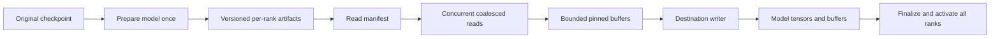

**Generic model loading at NVMe speed — implementation plan**

**Implementation:** [The loader is built and deployed on all four Sparks](NVME-LOADER-IMPLEMENTATION.md).
The verified implementation uses pre-kernel rank-local artifacts, concurrent
direct reads and persistent compiler/driver caches. Target restoration is about
8 seconds per rank; verified full restarts take 82–87 seconds. The original
30–60 second end-to-end objective remains open.

Build a model-independent, bounded NVMe read pipeline and integrate it with vLLM's model-loading lifecycle. Prepare per-rank artifacts ahead of switching so activation streams the bytes each worker actually needs. Keep kernel compilation and model preparation out of routine activation wherever the runtime permits it.

Use the supplied **4,000–5,000 MB/s per-node NVMe bandwidth** and **8–15 minute current startup** as planning inputs. There is no preliminary measurement campaign, drive benchmark, tuning sweep or request to re-establish those facts. This document specifies the implementation. Correctness checks are part of implementing it; performance investigation is not a prerequisite.

The scope is unrelated models supported by the selected vLLM runtime: dense and MoE architectures, different tensor shapes, different quantization methods and different parallel layouts. No GLM expert counts, DFlash behavior or cross-model KV reuse may be embedded in the common loader. Format and quantization compatibility are explicit adapter contracts, with a functional native-loader fallback.

**Outcome and budget**

For a 100 GB rank-local image, 4–5 GB/s implies **20–25 seconds of storage transfer**. For approximately 103 GB, it implies **21–26 seconds**. All nodes read their local artifacts concurrently; the slowest required rank determines readiness.

A 30–60 second activation objective is plausible for prepared models around that per-rank size if initialization, copies, transformations and activation checks fit the remaining budget. It is not a size-independent promise. The bandwidth applies to bytes read from disk; runtime expansion and postprocessing add work unless eliminated or overlapped.

Use this explicit target budget for an approximately 103 GB prepared rank image. It assigns work; it does not assert that all initialization already fits:

| Work | Planned budget | Implementation requirement |
| --- | --- | --- |
| Required target and auxiliary weight reads | 21–26 s | The image size includes every model component required at readiness |
| Graph capture | About 5 s as a reference; model-dependent | Reuse a valid live graph or recapture after restore |
| KV allocation, required recovery and connector setup | Up to 10 s target | Recover only admitted-session state; shared disk I/O remains within the total read budget |
| Process startup, imports, module loading, four-node communication and remaining finalization | Remaining budget, up to 19 s for a 60 s objective at the high read estimate | Persist/prebuild applicable artifacts; retain only resources the chosen activation mode actually preserves |
| Repeated compilation/autotuning | Zero repeat work target for an unchanged prepared plan | Valid versioned caches mounted outside replaceable containers |

First implement restart-based activation. A complete container/worker restart is not promised under 60 seconds merely because its reads fit in 26 seconds: process and communication initialization must also fit the remaining allocation. The earlier approximately 35-second pre-autotuner log gap is not assumed to disappear just by mounting a cache. A later warm-worker design can remove more startup work but is a separate implementation milestone.

The existing roughly 377 GiB source set is approximately 405 GB. Reading that much per node would take roughly 81–101 seconds even at the supplied bandwidth. That is an illustrative upper-volume case, not a claim that today's loader physically reads every byte. It makes the design requirement clear: **concurrent reads and rank-local preparation belong in the same solution**.

Time to model readiness also differs from a new conversation's time to first token. An unrelated incoming model must prefill its own uncached prompt. Durable KV can avoid that work only for a compatible prefix previously computed by that same model.

**Chosen architecture**

The transport layer understands files, byte ranges, checksums, destinations and completion events. Model adapters own the meaning of tensors, sharding and quantization. The activation controller owns worker configuration, all-rank readiness and routing. These interfaces let the same reader serve unrelated architectures without modifying its I/O implementation.

Prefer existing Run:ai streaming components for the initial backend where the installed version exposes bounded local-file reads; use fastsafetensors' supported non-GDS pipeline as an alternative. Hide either behind the same transport interface. If neither can implement the bounded destination contract, implement a native asynchronous file reader under that interface. Do not make choosing a library into a separate research phase.[1][2]

Select a local, single-rank reader on each node. Disable library modes that redistribute checkpoint tensors over a world-size process group. Each rank should saturate its local NVMe, rather than move the same loading traffic onto the NCCL ring. Normal model collectives remain separate from the storage reader.

**Step 1 — introduce the generic loader and explicit contracts**

Add an opt-in vLLM loader plugin, proposed name `nvme_stream`, plus a preparation command. Keep deployment changes behind that explicit selection until functional validation is complete. Proposed repository layout:

| Component | Responsibility |
| --- | --- |
| `runtime/nvme_loader/manifest.py` | Artifact schema, compatibility keys, tensor/storage descriptions |
| `runtime/nvme_loader/reader.*` | Native concurrent reads, range coalescing, bounded buffer ownership |
| `runtime/nvme_loader/writer.py` | Destination copies, completion events, tensor readiness |
| `runtime/nvme_loader/adapters/` | Checkpoint and runtime-state integration |
| `runtime/nvme_loader/prepare.py` | Offline artifact export and publication |
| `runtime/nvme_loader/loader.py` | vLLM plugin lifecycle and fallback selection |
| `runtime/nvme_loader/activation.py` | Coordinated worker activation and cache identity |

Use the following logical interfaces; the exact Python/C++ types are implementation details:

- `CheckpointAdapter.describe()` returns tensor names, source storage ranges and original metadata.
- `ModelAdapter.plan(config, rank)` describes model construction, owned tensors, alias relationships and any required transforms.
- `ArtifactAdapter.export()/restore()` defines whether a runtime layout can be saved and restored without repeating transforms.
- `DestinationWriter.submit(chunk)` installs bytes and returns an event or equivalent completion token.
- `ModelAdapter.finalize()` completes any deferred model-specific initialization before use.

Reuse vLLM's registered architecture implementations and native weight-loading semantics. Do not infer TP partitioning just by dividing tensor dimensions: embeddings, fused projections, replicated tensors, expert parallelism, padding and quantization scales have different ownership rules.

**Step 2 — make reading continuous and memory bounded**

Use initial defaults of **4 MiB chunks, 32 outstanding reads and a 512 MiB total staging budget per rank**. These are implementation defaults, not a requested parameter sweep. They leave space beyond the 128 MiB in-flight read payload for ready chunks and source buffers held by asynchronous copies. Count all such states against the same budget.

A producer parses file headers once, builds useful read ranges, merges adjacent ranges and continuously replenishes the read queue. Use positional reads so unrelated files/ranges do not contend on a shared file offset. The destination consumer copies and processes completed chunks while later reads continue. File boundaries must not impose a global read/process barrier.

Implement two explicit consumer modes. **Canonical mode** feeds complete logical tensors through the native `DefaultModelLoader.get_all_weights`/weight-loading contract, retaining source ordering and expert filtering. **Prepared mode** streams chunks directly into preallocated final rank-owned storage. The latter is the path to the 20–25 second per-100-GB budget. Canonical mode may still read a large unpartitioned checkpoint and perform all native transforms, so it is a compatibility path, not a promise of that budget.

Maintain `FREE → READING → READY → WRITING → FREE` buffer states. A source buffer remains owned until the consumer's copy or transform completion event fires. Bound both outstanding requests and completed-but-unconsumed bytes. A thread pool alone is not a byte budget.

Canonical mode reserves the entire logical tensor's required staging before submitting its first chunk. Its budget includes assembled tensors, ready tensors and sources held by device copies. Select the native low-memory route for an oversized tensor before reading any of it. Prioritize the next consumable tensor and reserve progress capacity so later completed tensors cannot occupy every slot while the consumer waits for an earlier tensor's missing chunks.

The loader owns completion tracking. For a native consumer whose source reads are confined to the current CUDA stream, record an event after the yielded tensor's callback returns, and release its storage only after that event completes. An adapter using additional streams or retaining the source beyond the callback must explicitly report those dependencies/lifetime; otherwise retain the native allocation path. A generator advancing is not by itself evidence that asynchronous consumers have finished reading the source.

Use supported pinned host buffers and asynchronous device copies first. Spark's shared physical memory does not make ordinary device allocations coherent CPU or storage-I/O destinations.[3] Keep CPU and discrete-GPU destination backends separate so the transport is reusable beyond GB10.

Prefer direct reads for aligned prepared segments, with a buffered positional-read fallback for unsupported alignment/filesystems. Preserve header and final-chunk correctness without assuming all files or buffers meet direct-I/O alignment. Bound the buffered read-ahead window too; never prefetch an entire multi-hundred-GB checkpoint into page cache.

Read completion may be out of order, while tensor publication respects adapter dependencies. Handle short reads, truncation, cancellation and failed integrity checks explicitly. Never publish a tensor with only some required chunks installed. Avoid device-wide synchronization between tensors; synchronize only on relevant events and at final activation.

**Step 3 — prepare per-rank artifacts once**

Introduce an explicit preparation lifecycle for every supported model/revision/configuration. Use the ordinary vLLM implementation to establish correct tensor ownership and quantization behavior, then export in bounded chunks. Preparation may be slow and require the model's normal memory footprint. It is performed before routine switching and does not require all catalog models to be resident simultaneously.

Provide two representations:

| Representation | Purpose | Compatibility behavior |
| --- | --- | --- |
| Canonical checkpoint tensors | Preserve native model-loader semantics while replacing serial payload I/O | Generic initial integration; some model transforms remain on activation |
| Prepared runtime tensors | Restore the exact rank-local layout already needed by kernels | Fast activation when a matching adapter can construct and restore that state |

A prepared artifact contains large aligned data segments and a manifest with storage IDs, tensor names, byte offsets, dtype, shape, stride, aliases/tied weights, padding, parameters, required buffers, quantization scales and checksums. Include all inference state the adapter declares necessary, including auxiliary model components; a default parameter-only `state_dict` dump is insufficient.

Use the existing weight-cache `export_entries` semantics as the reference for parameter/buffer enumeration: `remove_duplicate=False`, explicit aliases, and reconstruction of shared object identity. Carry adapter-defined non-tensor state or deterministic reconstruction instructions as well; post-load processing can convert scale tensors into Python attributes. Disk artifacts contain reconstructible storage descriptions, never live IPC handles or process addresses.[4]

The compatibility key includes original model revision/content, architecture configuration, quantization method, TP/PP/EP ownership and rank ordering, device architecture, adapter/schema versions, runtime/dependency identity and any configuration that affects tensor layout. Keep tokenizer, templates and processors in the model package but distinguish their identity from raw tensor layout.

Checksums are computed during preparation and verified in the streaming path. Publish the prepared artifact only after all segments and manifests are complete, using an atomic completion record. Missing or incompatible artifacts select preparation/native fallback before allocation mutation. A corrupt selected artifact fails the activation; do not silently serve partially restored state.

No export may allocate a second complete CPU copy of the model. Copy and write bounded chunks. Tied/shared storage is serialized once and reconstructed as aliases. Weight bytes are immutable during inference, so evicting an unchanged model requires no weight write-back.

**Step 4 — preserve generic model support honestly**

| Model/checkpoint category | Required behavior |
| --- | --- |
| Dense and MoE safetensors | Common reader; architecture-owned destination/sharding rules |
| Quantized tensors, including mixed schemes | Keep native quantization semantics; prepared runtime path only with an explicit restore contract |
| Tensors larger than the staging budget | Chunk directly into compatible final destinations; otherwise use native low-memory loading for that tensor |
| Noncontiguous/aliased tensors | Manifest storage/view descriptions and adapter-defined copies; preserve tying |
| PyTorch `.bin`/`.pt` and other supported formats | Native preparation or existing deserializer, followed by the same artifact format |
| GGUF or other specialized loaders | Registered format adapter where supported; native loader fallback otherwise |
| Encoder-decoder and multimodal models | Include every required model component and processor configuration in preparation/readiness |
| Draft/speculative models | Separate correctly owned artifacts and state; no assumption that all models use a drafter |
| Custom modules or opaque runtime state | Explicit adapter support or native loading; never pretend arbitrary state is raw tensor bytes |

Canonical tensor loading must not force whole oversized source tensors into the 512 MiB pool. Some native `load_weights` callbacks require a complete logical tensor and cannot accept arbitrary chunks. For those cases, use a supported destination-aware adapter or preserve the native mmap/low-memory route. Chunking belongs below a valid model loading contract; it cannot be invented by slicing tensors indiscriminately.

Compatibility fallback keeps models usable; it does not promise the same speed for unsupported optimized paths. Generic support means one model-independent transport with explicit adapters, not a claim that one post-load binary layout can be restored by every model class.

The prepared-runtime adapter must construct the correct module/tensor state without repeating incompatible quantization transforms. If it cannot, use the canonical/native representation. Never both restore already-packed tensors and run the original packing pass on them again.

Make this concrete by reusing vLLM's `weights_already_processed()` contract and the weight-cache IPC loader's model construction recipe: initialize compatible modules on meta storage, register restored parameters and buffers plus aliases, run supported post-load hooks in preprocessed mode to rebuild runtime objects, then materialize only required remaining state. The disk adapter supplies tensor storage in place of IPC mappings. Required leftover meta tensors must have a declared initializer or restored value; never mark uninitialized inference state ready.[4]

Gate prepared restoration on every participating quantization method's `supports_pre_processed_weights` capability and its cache-scale compatibility. Do not globally skip post-load hooks, and do not merely flip the capability flag. Add explicit prepared-state implementations for **CompressedTensors WNA16 linear and Marlin MoE**, including kernel/workspace reconstruction and scale state. These are named initial adapter deliverables because the production model uses that family; the reader remains architecture-independent. Other GPTQ/AWQ/Marlin variants need their own capability coverage or native fallback. The ordinary sharded-state loader alone does not establish that postprocessed shapes can be restored safely.

**Step 5 — keep routine initialization out of switching**

Persist compiled kernels and compatible Torch/Triton/FlashInfer artifacts under versioned host-mounted paths. Prepare model plans ahead of activation when the runtime supports this. Reuse an already-running model skeleton only when its retained memory fits and its model-specific state remains valid.

Explicitly persist the FlashInfer/vLLM cache currently written below `/root/.cache/vllm`, in addition to the already mounted Triton cache. Make this a launcher integration change in the plan; no live launcher change is performed here.

Unrelated architectures may require distinct worker plans, buffer layouts, collectives and tokenizer/processor state. Keep the common controller alive; recreate or select those model-specific resources as needed. Reuse communicator handles only within supported process lifetimes and compatible topologies.

This loader does not serialize live CUDA graphs as portable files. Reuse graphs only inside a valid retained execution plan; otherwise recapture the required set after destinations are initialized. Cached compiled kernels and a live captured graph are different resources.

**Step 6 — integrate unrelated-model switching and durable KV**

Before cutover, select B's configuration and verify that its prepared artifacts exist on every required node. Stop admitting A work, drain to a defined boundary, fence pending GPU and KV transfers, then release A's allocations when needed for capacity. Keeping A fully serving while B loads requires enough memory or separate hardware; the reader cannot create that capacity.

For the first implementation, release A by stopping its worker processes and launch B's workers with B's full configuration and the new loader. Do not call `reload_weights` to replace an unrelated architecture: that method loads into existing model structure. In-process architecture replacement requires a later dedicated operation covering model modules, allocator pools, KV geometry, graphs, scheduler, tokenizer and connector teardown/rebuild.

Load B on all nodes concurrently. Select B's tokenizer, processors, templates, optional draft and execution plan together. Recover only B's compatible durable KV needed for admitted requests. A's persisted KV remains available for a later return to A but cannot be attached to unrelated B.

Weights and KV share the drive's 4–5 GB/s budget. Give bulk model activation priority, with bounded request-critical KV recovery; leave other session caches on disk. Only use a namespace when its model revision and cache layout match. Do not change the existing CRC or rank-completion guarantees.

Every rank must report the same activation generation and compatible artifact identities before the route commits. On a failed read, failed rank or failed finalize, keep B unavailable and release partial allocations. A remains recoverable from its own artifact/cache; rollback is another load if A was already evicted.

Extend worker initialization/readiness reporting with `{generation, model_content_id, execution_key, rank_artifact_id, finalized}`. The activation supervisor gathers receipts over its control channel after worker initialization; it compares them with the prepared set before opening request admission. Rank artifact IDs differ by rank and are checked against the expected manifest, while model content and execution identity must agree. This is an explicit control-plane extension, not an assumption that a generic load RPC already exists before worker message queues initialize. Failure cleanup in this first milestone is worker-process exit.

Keep canonical model content identity separate from artifact layout identity and directory paths. Compute content digests during preparation over actual model data and relevant configuration, rather than treating header-only or size/mtime fingerprints as proof of identical weights. Have the KV connector consume the manifest's canonical identity when prepared weights are active; preserve its remaining dtype/layout/runtime compatibility checks. A newly packed artifact of the same compatible model must not appear to be an unrelated model merely because its files moved.

Allocate separate KV namespaces by canonical model identity and cache execution key. Treat the current **150 GB per rank as a global cache budget across models**, not 150 GB multiplied by the catalog size. Add explicit namespace quota/reclamation accounting; do not instantiate a full preallocated slab per model. Inactive entries can be reclaimed within that policy, while retained namespaces remain available on return. Migrating the current fixed slab layout to shared-budget stores is a planned connector change; no automatic directory switch or wipe is assumed to preserve old caches.

**Implementation order and completion criteria**

| Order | Deliverable | Completion criterion |
| --- | --- | --- |
| 1 | Loader plugin, manifest and transport/writer interfaces | Explicit opt-in selection and native fallback |
| 2 | Bounded asynchronous read/copy pipeline | Continuous read scheduling, correct ownership and cancellation |
| 3 | Canonical safetensors integration | Existing architecture/quantization behavior preserved |
| 4 | Chunked preparation and runtime-layout adapters | Preprocessed-state contract, initial WNA16/Marlin coverage, correct aliases/non-tensor state, no duplicate full copies or double transforms |
| 5 | Persistent compilation artifacts and restart-based activation | Initialization receipts, all-rank readiness, canonical B identity and globally budgeted per-model KV namespaces |
| 6 | Broaden adapter coverage | Dense, MoE, quantized, oversized, aliased and auxiliary-model cases supported or explicitly fall back |

In-process switching between unrelated architectures is a later optional milestone after restart-based generic loading works. It is not a prerequisite for the reader and preparation work.

Plan functional validation around small representative models and tensor fixtures: source/restored tensor equivalence, greedy generation, quantization metadata, aliases, oversized tensors, corruption, cancellation and a failed rank. Test A → unrelated B → A to catch identity and stale-cache errors. These are implementation correctness checks, not a preliminary storage measurement exercise.

Retain ordinary loader completion/error reporting and configured byte budgets. No standalone fio phase, baseline capture campaign or concurrency sweep is required to start implementing this plan. The supplied storage bandwidth is the design input.

**Expected result**

Routine activation becomes: select a prepared model package, stream each rank's local tensors through a continuously filled bounded pipeline, restore compatible model-specific runtime/cache state, then commit serving. A roughly 100 GB per-rank model has a 20–25 second ideal read budget at the supplied drive speed, leaving the balance of the 30–60 second objective for required setup. First-use preparation, larger artifacts and fresh long-context prefill remain distinct costs.

**Evidence and references**

The installed vLLM 0.29 loader was previously inspected in the serving container: ordinary safetensors iteration walks files and yields tensors to the consumer; the recorded EXT4 startup had automatic prefetch disabled. See the recorded startup (local reference: `results/vllm029-upgrade/upgrade-029-r8/running-spark-06c4.local.log`) and [launcher](../runtime/vllm029/launch.sh). This confirms the existing integration point; no further investigation is a prerequisite.

1. vLLM, [Run:ai streaming integration and sharded loading](https://github.com/vllm-project/vllm/blob/main/docs/models/extensions/runai_model_streamer.md), previously checked September 13, 2026. Exact installed-package capabilities govern the backend integration.
2. Foundation Model Stack, [fastsafetensors overview](https://github.com/foundation-model-stack/fastsafetensors/blob/main/docs/overview.md), previously checked September 13, 2026. Alternative pipeline backend with a non-GDS path.
3. NVIDIA, [DGX Spark CUDA porting guide](https://docs.nvidia.com/dgx/dgx-spark-porting-guide/porting/cuda.html), previously checked September 13, 2026. Memory-access constraints motivate a supported host-buffer path first.
4. Local runtime references: preprocessed-state context (local reference: `upstream-vllm/vllm/model_executor/utils.py`), post-load capability guard (local reference: `upstream-vllm/vllm/model_executor/model_loader/utils.py`), IPC restore recipe (local reference: `upstream-vllm/vllm/model_executor/model_loader/weight_cache/ipc_loader.py`), and export entries (local reference: `upstream-vllm/vllm/model_executor/model_loader/weight_cache/daemon.py`). Bind the implementation to the pinned runtime's matching interfaces; this is source integration work, not a storage benchmark phase.

**Claude review**

Claude reviewed the draft through herdr in the `fable-review` agent. Its six findings covered prepared quantization support, canonical versus prepared consumer modes, buffer lifetime/deadlock prevention, restart versus in-process activation, prepared-artifact KV identity, and the startup budget. The revisions above address all six. The review supported the transport/manifest design and implementation order with those changes; it did not validate performance or certify an implemented loader. See the [review record](NVME-LOADING-FABLE-REVIEW.md).
