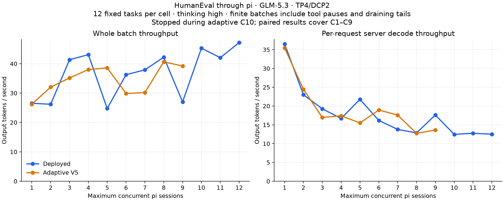

# HumanEval through pi: deployed versus adaptive

Run status: aborted at user request; completed cells analyzed and incomplete cells excluded.

Twelve preselected HumanEval tasks, one solve per task at every C1–C12. Real pi 0.85.1 RPC sessions launched by the benchmark in herdr; GLM-5.3 settings, thinking high, temperature 0, top_p 1, 32768 output-token limit. The pi read/bash/edit/write tools and user SYSTEM.md are retained. Optional packages, skills, context files, and other extensions are disabled identically; the observer extension does not change provider payloads.

The ten tasks from the previous HE10 benchmark are supplemented by HumanEval/0 and /22 so C12 can start twelve distinct tasks. Every cell uses all twelve tasks, a fixed shuffled order shared by both stacks, fresh sessions, a synchronized first wave, and at most C active sessions. A free slot takes the next task. This is a finite batch, not steady-state serving; tool gaps and the final draining tail reduce realized concurrency. Pi startup is excluded before the first wave; replacement-session startup is included in batch wall time.

Aggregate tok/s = provider-reported output tokens / first task submission to last task completion. Per-request tok/s = output tokens / summed provider request times, including TTFT. Output tokens include any reasoning and tool-call serialization; reasoning is never added twice. Server decode tok/s additionally excludes server-reported queue/prefill intervals. These measure all agent calls, not just code in solution.py. The exported reasoning-token count can be zero when the backend omits that breakdown.

| C | Deployed aggregate tok/s | Adaptive aggregate tok/s | Change | Deployed per-request tok/s | Adaptive per-request tok/s | Tests deployed / adaptive |
|---:|---:|---:|---:|---:|---:|:---|
| 1 | 26.53 | 26.22 | -1.1% | 27.46 | 27.10 | 12/12 / 12/12 |
| 2 | 26.19 | 32.04 | +22.4% | 19.28 | 18.72 | 12/12 / 11/12 |
| 3 | 41.36 | 35.15 | -15.0% | 14.87 | 13.48 | 12/12 / 12/12 |
| 4 | 43.08 | 38.01 | -11.8% | 12.32 | 13.44 | 12/12 / 12/12 |
| 5 | 24.75 | 38.56 | +55.8% | 19.69 | 11.67 | 12/12 / 12/12 |
| 6 | 36.26 | 29.85 | -17.7% | 12.84 | 15.07 | 12/12 / 12/12 |
| 7 | 37.90 | 30.19 | -20.3% | 10.25 | 14.00 | 12/12 / 12/12 |
| 8 | 42.22 | 40.64 | -3.7% | 9.56 | 9.09 | 12/12 / 12/12 |
| 9 | 26.99 | 39.22 | +45.3% | 14.21 | 9.68 | 12/12 / 12/12 |
| 10 | 45.27 | incomplete; excluded | — | 8.46 | — | 12/12 / — |
| 11 | 42.06 | not run | — | 7.95 | — | 12/12 / — |
| 12 | 47.17 | not run | — | 7.58 | — | 11/12 / — |

The adaptive runtime is the exact source set saved as hints-conf-20260909-r2, using its repaired measured cost curve. Confidence collection and client workload hints are off. Policy trace is on. The controller is eligible only for a single pure-decode request and otherwise falls back to K7; C>1 is a concurrency/fallback comparison, not a claim of multi-request adaptive verification. The experimental runtime also includes the replicated draft-cache repair, so this is a deployed-stack comparison, not an isolated controller-only A/B.

All deployed cells run before all adaptive cells, with equal per-lane warmups; prefix caches are left enabled and can warm naturally. Cold cache state and temporal drift are not eliminated. After the requested abort, restoration uses one short native pi probe; the optional restored baseline C1/C12 repeatability batches are omitted. Those restoration checks use fresh scratch paths, so their system prompts differ in the working-directory line; they are approximate repeatability checks. One small fixed sample per cell gives descriptive results, not a general HumanEval score or a confidence interval. Official hidden tests run after generation in a networkless bubblewrap process with CPU, memory, and wall limits, and no feedback goes to the agent.

Dataset: [OpenAI HumanEval](https://github.com/openai/human-eval/tree/6d43fb980f9fee3c892a914eda09951f772ad10d). The pinned twelve prompts and tests, selection, source hash, and MIT license are in `bench/pi_throughput/`. Raw pi events, generated solutions, provider observations, server counters, source audits, and restoration evidence accompany this report.

An initial C3 batch exceeded the 600-second per-task watchdog on HumanEval/132. Its incomplete events and metrics are preserved under `incomplete-attempts/`; it is excluded from scored rates. The entire C3 batch was retried with a longer watchdog and identical pi request settings. Resume records document the bound. Completed C1/C2 cells were retained. This retry introduces additional cache warming and must be considered when interpreting the small sample.

## Functional outcomes and measurement checks

deployed: 143/144 official tests passed across 12 completed cells.

adaptive: 107/108 official tests passed across 9 completed cells.

Functional failures remain in throughput measurements. The failed solves are:

| Lane | C | Task | Output tokens | Task seconds |
|:---|---:|:---|---:|---:|
| deployed | 12 | HumanEval/132 | 953 | 82.98 |
| adaptive | 2 | HumanEval/132 | 1456 | 75.46 |

Completed cells with measurement validity flags: 0.

## Output lengths and batch durations

Different reasoning lengths change the mix of work in each batch. Aggregate tok/s differences therefore combine serving speed, output length, tool use, and time spent at each realized concurrency; they are not pure engine speedup estimates.

| Lane | C | Output tokens | Batch seconds |
|:---|---:|---:|---:|
| deployed | 1 | 4090 | 154.18 |
| deployed | 2 | 7412 | 283.02 |
| deployed | 3 | 4218 | 101.99 |
| deployed | 4 | 4047 | 93.94 |
| deployed | 5 | 24013 | 970.03 |
| deployed | 6 | 6723 | 185.39 |
| deployed | 7 | 4136 | 109.14 |
| deployed | 8 | 4764 | 112.84 |
| deployed | 9 | 11888 | 440.40 |
| deployed | 10 | 4518 | 99.80 |
| deployed | 11 | 3766 | 89.55 |
| deployed | 12 | 3914 | 82.98 |
| adaptive | 1 | 4193 | 159.90 |
| adaptive | 2 | 4534 | 141.49 |
| adaptive | 3 | 4326 | 123.07 |
| adaptive | 4 | 4568 | 120.19 |
| adaptive | 5 | 4597 | 119.22 |
| adaptive | 6 | 7938 | 265.95 |
| adaptive | 7 | 9091 | 301.17 |
| adaptive | 8 | 4050 | 99.66 |
| adaptive | 9 | 4499 | 114.72 |

## Additional measurements

| Lane | C | Server decode tok/s | Median task seconds | Median first-output seconds | Mean / max running requests |
|:---|---:|---:|---:|---:|:---|
| deployed | 1 | 36.54 | 8.83 | 1.15 | 0.95 / 1 |
| deployed | 2 | 22.99 | 17.15 | 1.52 | 1.28 / 2 |
| deployed | 3 | 19.27 | 19.49 | 1.72 | 2.39 / 3 |
| deployed | 4 | 16.69 | 22.15 | 2.20 | 2.95 / 4 |
| deployed | 5 | 21.78 | 22.57 | 2.52 | 1.20 / 5 |
| deployed | 6 | 16.17 | 30.73 | 2.44 | 2.47 / 6 |
| deployed | 7 | 13.79 | 29.23 | 2.48 | 3.05 / 7 |
| deployed | 8 | 12.84 | 39.92 | 3.02 | 3.56 / 8 |
| deployed | 9 | 17.61 | 37.53 | 3.25 | 1.63 / 9 |
| deployed | 10 | 12.47 | 42.78 | 2.86 | 4.02 / 10 |
| deployed | 11 | 12.76 | 31.96 | 3.01 | 3.63 / 10 |
| deployed | 12 | 12.51 | 42.09 | 2.91 | 4.15 / 10 |
| adaptive | 1 | 35.45 | 9.52 | 1.17 | 0.94 / 1 |
| adaptive | 2 | 24.44 | 12.76 | 1.60 | 1.57 / 2 |
| adaptive | 3 | 16.97 | 18.89 | 1.70 | 2.32 / 3 |
| adaptive | 4 | 17.40 | 21.15 | 2.35 | 2.42 / 4 |
| adaptive | 5 | 15.51 | 26.73 | 2.53 | 2.78 / 5 |
| adaptive | 6 | 18.94 | 28.66 | 2.61 | 1.72 / 6 |
| adaptive | 7 | 17.60 | 37.45 | 2.80 | 1.87 / 7 |
| adaptive | 8 | 12.75 | 33.89 | 2.90 | 3.51 / 8 |
| adaptive | 9 | 13.59 | 31.05 | 2.79 | 3.12 / 9 |

## Adaptive policy observations

| C | Completed verification rows | Caps (K: rows) | C1-eligible rows |
|---:|---:|:---|---:|
| 1 | 783 | {7: 523, 3: 74, 5: 186} | 783 |
| 2 | 860 | {7: 722, 3: 50, 5: 88} | 253 |
| 3 | 874 | {7: 799, 5: 75} | 127 |
| 4 | 869 | {7: 680, 5: 128, 3: 61} | 265 |
| 5 | 890 | {7: 688, 5: 148, 3: 54} | 270 |
| 6 | 1813 | {7: 957, 3: 134, 5: 722} | 1290 |
| 7 | 2101 | {7: 1109, 5: 925, 3: 67} | 1466 |
| 8 | 755 | {7: 645, 5: 110} | 266 |
| 9 | 896 | {7: 641, 3: 1, 5: 254} | 361 |

## Intervals with all C requests running

This supplementary estimate addresses the long draining tails. It uses the existing server generation counter only while the exported running-request gauge stays at C with no queued requests. The first five seconds after entering each interval are discarded for exporter lag, then at least five seconds must remain. Rates pool tokens and elapsed time across qualifying intervals. These short telemetry windows are not independently repeated steady-state tests; changing prompt mix and exporter granularity still matter.

| Lane | C | Aggregate tok/s at full C | Retained seconds |
|:---|---:|---:|---:|
| deployed | 1 | 27.12 | 104.4 |
| deployed | 2 | 34.96 | 7.1 |
| deployed | 3 | insufficient interval | 0.0 |
| deployed | 4 | insufficient interval | 0.0 |
| deployed | 5 | insufficient interval | 0.0 |
| deployed | 6 | insufficient interval | 0.0 |
| deployed | 7 | insufficient interval | 0.0 |
| deployed | 8 | insufficient interval | 0.0 |
| deployed | 9 | insufficient interval | 0.0 |
| deployed | 10 | insufficient interval | 0.0 |
| deployed | 11 | insufficient interval | 0.0 |
| deployed | 12 | insufficient interval | 0.0 |
| adaptive | 1 | 26.15 | 100.5 |
| adaptive | 2 | 32.56 | 5.1 |
| adaptive | 3 | 53.56 | 7.1 |
| adaptive | 4 | insufficient interval | 0.0 |
| adaptive | 5 | insufficient interval | 0.0 |
| adaptive | 6 | insufficient interval | 0.0 |
| adaptive | 7 | insufficient interval | 0.0 |
| adaptive | 8 | insufficient interval | 0.0 |
| adaptive | 9 | insufficient interval | 0.0 |

Verification traces are joined by each cell’s wall-clock interval. They exclude some terminal/invalid-feedback cycles by design. Short caps can occur in C>1 cells when only one request remains active. Any ineligible short-cap row is retained in audit.json for inspection; the trace does not claim every launched session is always decoding.

Matched initial request pairs: 108; native provider settings equal: True; serialized initial messages equal: True.

Exact original containers, images, commands, selected environment, and Python mounts restored: True.

Restoration generation check: one native pi solve passed its official test, with no measurement validity flags. Evidence: `restoration-probe-final/restored-probe-summary.json`.
